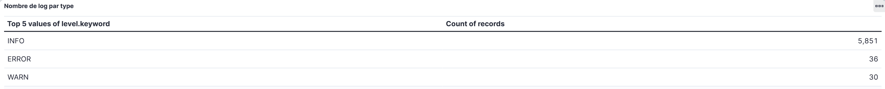
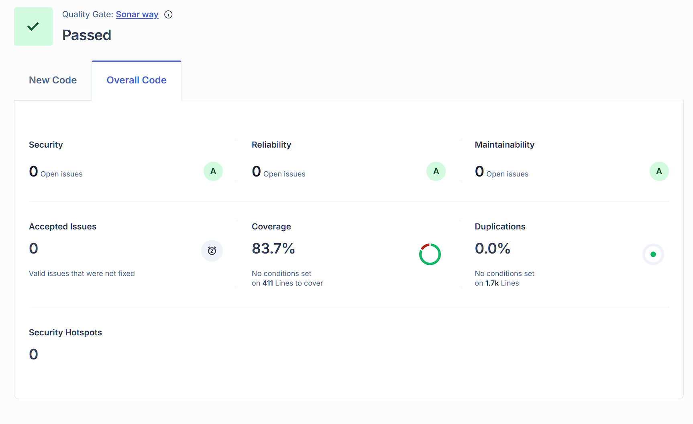
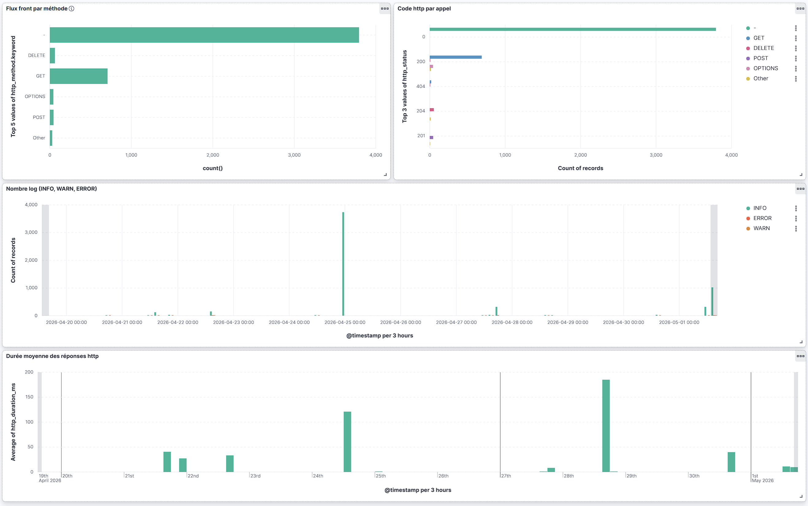
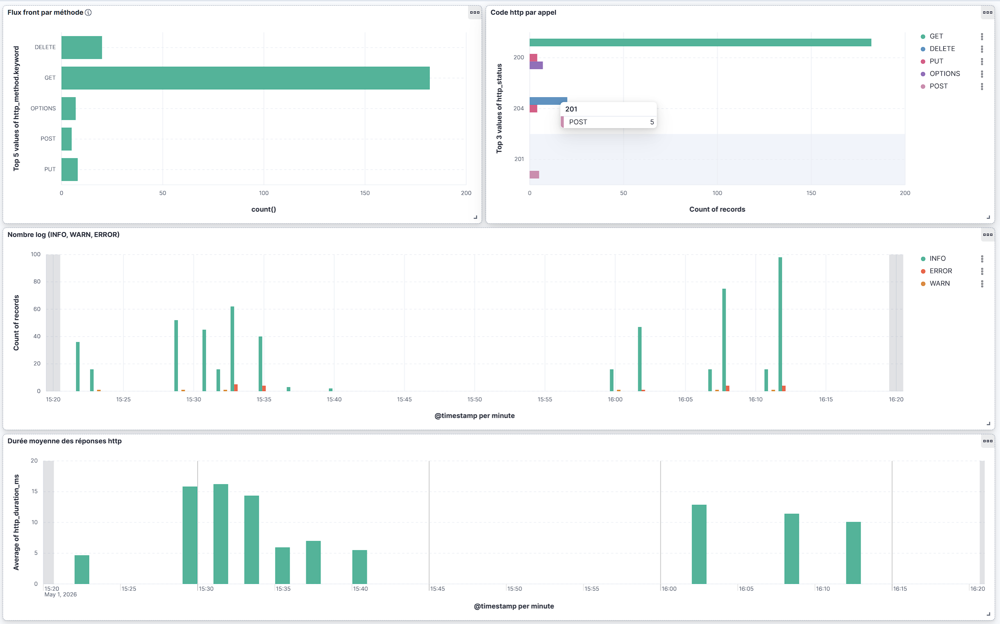

# MicroCRM Documentation finale

**Auteur :** Kevin Renault
**Projet :** OpenClassrooms — Projet 7 — Intégration et déploiement continus
**Date :** Mai 2026
**Version :** 1.0.0

---

## Sommaire global

- [Objectif](#objectif)
- [Contexte technique retenu](#contexte-technique-retenu)
- [1. Synthèse des métriques DORA](#1-synthèse-des-métriques-dora)
- [2. KPI complémentaires](#2-kpi-complémentaires)
- [3. Résultats SonarQube](#3-résultats-sonarqube)
- [4. Tableaux de bord ELK](#4-tableaux-de-bord-elk)
- [5. Recommandations d'amélioration continue](#5-recommandations-damélioration-continue)
- [6. Étapes de mise en oeuvre CI/CD](#6-étapes-de-mise-en-oeuvre-cicd)
- [7. Plan de testing périodique](#7-plan-de-testing-périodique)
- [8. Plan de conteneurisation et de déploiement](#8-plan-de-conteneurisation-et-de-déploiement)
- [9. Analyse des métriques](#9-analyse-des-métriques)
- [10. Plan de sécurité](#10-plan-de-sécurité)
- [11. Plan de sauvegarde des données](#11-plan-de-sauvegarde-des-données)
- [12. Plan de mise à jour](#12-plan-de-mise-à-jour)
- [13. Conclusion](#13-conclusion)

## Objectif

Ce document centralise les éléments du livrable final : métriques DORA, KPI, résultats SonarQube, tableaux de bord ELK, recommandations d'amélioration continue et plans opérationnels (testing, sécurité, déploiement, sauvegarde, mise à jour). Il complète le README du dépôt.

## Contexte technique retenu

- application full-stack composée d'un back-end Spring Boot et d'un front-end Angular;
- pipeline CI/CD automatisé dans GitHub Actions;
- analyse qualité et sécurité intégrée via SonarQube Cloud;
- supervision locale via une stack ELK composée d'Elasticsearch, Logstash et Kibana;
- centralisation des logs applicatifs dans Kibana via Logstash.

## 1. Synthèse des métriques DORA

### Lead Time for Changes

Mesure consolidée sur le flux `dev -> main` de la période analysée.

- valeur retenue : 26.99 h;
- méthode de calcul : temps entre le commit d'un changement et sa mise à disposition dans l'environnement cible;
- source de mesure : historique Git (merges PR) et script de calcul du rapport DORA.

### Deployment Frequency

Fréquence calculée sur les exécutions `success` du workflow CI sur `main`.

- valeur retenue : 4.37 déploiements/semaine;
- méthode de calcul : nombre de déploiements ou de publications réalisées sur une période donnée;
- source de mesure : API GitHub Actions sur `ci.yml` (`branch=main`, `event=push`).

### Mean Time to Restore

Mesure calculée entre un run en échec et le prochain run en succès.

- valeur retenue : 89.57 h;
- méthode de calcul : durée moyenne entre la détection d'un incident et le rétablissement du service;
- source de mesure : historique des runs GitHub Actions (`failure -> success`) sur `ci.yml`.

### Change Failure Rate

Mesure consolidée sur la même fenêtre que les autres métriques DORA.

- valeur retenue : 10.00% (2 échecs sur 20 runs);
- méthode de calcul : rapport entre les changements problématiques et le nombre total de changements livrés;
- source de mesure : conclusions `success`/`failure` des runs GitHub Actions.

## 2. KPI complémentaires

### Temps de build du back-end

- valeur retenue : 1.38 min;
- objectif : identifier les zones de lenteur dans la chaîne CI;
- source : logs GitHub Actions et tâche Gradle.

### Temps de build du front-end

- valeur retenue : 1.04 min;
- objectif : suivre l'impact des évolutions Angular sur la durée de CI;
- source : logs GitHub Actions et scripts npm.

### Temps d'exécution des tests

- valeur retenue : 2.00 min;
- objectif : vérifier la stabilité et le coût des tests automatisés;
- source : sorties de tests front et back.

### Temps moyen de la pipeline complète

- valeur retenue : 6.43 min;
- objectif : suivre la durée de bout en bout d'un run CI (vue utilisateur/pipeline globale);
- source : run complet GitHub Actions `ci.yml` (de `run_started_at` à `updated_at`).

Le rapport KPI intègre aussi un tableau journalier du temps maximal de pipeline. Il permet de suivre, jour par jour, le run le plus long, le nombre de runs observés et l'écart par rapport à la veille pour repérer rapidement une dérive de performance.

### Taux de succès CI

- valeur retenue : 90.91%;
- objectif : suivre la stabilité globale de la pipeline et repérer les régressions d'intégration;
- source : runs `success`/`failure` du workflow GitHub Actions `ci.yml`.

### Qualité SonarQube

- valeur retenue : durée moyenne du job SonarQube = 1.21 min (indicateur de performance pipeline);
- objectif : surveiller les vulnérabilités, code smells, duplications et couverture de tests;
- source : rapport SonarQube Cloud.

### Fréquence des erreurs applicatives

- valeur retenue : mesurable via le tableau de bord Kibana (panneau "Nombre de log par type") ;
- méthode : comptage par `level.keyword` (INFO / WARN / ERROR) sur l'index `microcrm-logs-*` ;
- objectif : observer la stabilité fonctionnelle à partir des logs ;
- source : dashboard Kibana.

> **Remarque importante :** en l'absence de politique de gestion d'erreurs globale et centralisée, l'absence d'ERROR dans ces logs ne signifie pas l'absence d'erreurs dans l'application — cela signifie seulement que les erreurs non gérées explicitement ne sont pas tracées. C'est l'équivalent de creuser dans son jardin, ne pas trouver de diamant, et en conclure qu'il n'en existe pas sur Terre. Seul un mécanisme de gestion global (ex. `@ControllerAdvice` côté back, `ErrorHandler` global côté front) permettrait de capturer toutes les erreurs de manière exhaustive et de rendre ces indicateurs réellement fiables.

## 3. Résultats SonarQube

### Synthèse

L'analyse la plus récente est conforme au profil `Sonar way` et passe la Quality Gate.

- projet analysé : back-end Spring Boot et front-end Angular;
- qualité surveillée : vulnérabilités, bugs, code smells, duplications, couverture de tests;
- Quality Gate : Passed;
- profil de qualité : Sonar way;
- sécurité : A (0 issue);
- fiabilité : A (0 issue);
- maintenabilité : A (0 issue);
- accepted issues : 0;
- security hotspots : 0.

### Points d'attention

- vulnérabilités prioritaires : aucune détectée (0 issue);
- duplications de code : 0.0 % sur 1.7k lignes;
- zones à forte complexité : aucune zone à forte complexité détectée (complexité cyclomatique non signalée par SonarCloud dans l'analyse actuelle, 0 code smell, 0 bug);
- couverture de tests : 83.7 % sur 411 lignes à couvrir.

### Politique de maintien qualité

Les résultats actuels étant sains (A/A/A, 0 issue, 83.7 % de couverture), l'objectif est de **maintenir** ce niveau :

- maintenir la couverture de tests au-dessus de 80 % : toute nouvelle fonctionnalité doit être couverte avant merge ;
- la Quality Gate SonarQube est un critère bloquant : **aucune PR ne doit être mergée si la Quality Gate est en échec** — c'est une règle d'équipe, pas une suggestion ;
- surveiller les nouvelles dépendances introduites (`npm audit`, `./gradlew dependencies`) à chaque ajout de librairie ;
- réexécuter l'analyse SonarCloud après chaque feature significative pour détecter toute régression au plus tôt ;
- ne pas désactiver ou contourner les règles SonarQube (exclusions de fichiers, suppressions d'alertes) sans décision justifiée en revue de code, validée conjointement par le tech lead et le Product Owner.

### Capture SonarQube

La capture suivante illustre la Quality Gate validée ainsi que les métriques globales (A/A/A, 83.7 % de couverture, 0.0 % de duplications).

## 4. Tableaux de bord ELK

### État de la stack

La stack locale est alignée avec l'énoncé : Elasticsearch, Logstash et Kibana sont présents dans la configuration Docker Compose dédiée.

### Visualisations implémentées

- volume global des logs;
- répartition des niveaux de logs;
- erreurs ou événements anormaux;
- activité du front et du back;
- temps de réponse ou indicateurs proches si disponibles.

### Captures du dashboard

- dashboard principal (vue agrégée des flux, statuts HTTP, niveaux de logs et durées moyennes) :

- dashboard détaillé (fenêtre de 60 minutes, utile pour observer les pics d'activité) :

## 5. Recommandations d'amélioration continue

### CI/CD

- conserver les tests automatiques dans les workflows GitHub Actions;
- surveiller les temps de build pour repérer les régressions de performance;
- éviter d'ajouter des étapes inutiles au pipeline.

### Qualité et sécurité

- utiliser SonarQube Cloud comme point de contrôle régulier;
- privilégier les corrections ciblées sur les zones les plus risquées;
- éviter l'introduction de secrets dans les workflows ou les images.

### Observabilité

- enrichir les dashboards Kibana au fil des nouvelles fonctionnalités loggées;
- conserver une structure de logs exploitable dans Elasticsearch;
- suivre les erreurs front et back dans un même dashboard lorsque c'est pertinent.

## 6. Étapes de mise en oeuvre CI/CD

### Objectif

Documenter les étapes concrètes réalisées pour industrialiser le pipeline CI/CD du projet.

### Étapes réalisées

- analyse initiale du dépôt (front Angular, back Spring Boot) : structure monorepo validée avec builds/tests distincts front et back;
- définition des plans préalables (tests, sécurité, déploiement) : plans structurés dans les sections 7, 8, 10, 11 et 12 du présent document;
- mise en place CI GitHub Actions (build, tests, SonarQube) : workflow `.github/workflows/ci.yml` actif avec jobs tests, analyse Sonar, build/push d'images et validations Docker;
- validation de la conteneurisation (Dockerfiles, docker-compose) : vérifications automatiques backend/frontend via `docker compose` et healthchecks HTTP dans la CI;
- automatisation CD (publication / déclenchement de déploiement) : publication automatisée en push `main` (packages GitHub Packages + images GHCR versionnées) via job `release`.

### Commandes clés et emplacement

| Commande | Objectif | Emplacement | Moment d'exécution |
| --- | --- | --- | --- |
| `./gradlew test` | Tests back-end | `back/build.gradle` | CI + local |
| `ng test --watch=false` | Tests front-end | `front/package.json` | CI + local |
| `docker compose up -d --build` | Build et lancement des services | `docker-compose.yml` | local / pré-prod |
| `docker compose -f docker-compose-elk.yml up -d` | Lancement de la stack ELK (Elasticsearch, Logstash, Kibana) | `docker-compose-elk.yml` | local / supervision |
| `workflow ci.yml` | Orchestration pipeline CI | `.github/workflows/ci.yml` | push / PR |

### Workflows auxiliaires disponibles

En complément du pipeline principal, trois workflows sont disponibles pour les opérations ponctuelles de suivi et de publication.

#### Rapport KPI (`kpi-report.yml`)

- **Déclenchement :** manuel uniquement (`workflow_dispatch` depuis l'onglet Actions de GitHub) ;
- **Rôle :** interroge l'API GitHub Actions, calcule les indicateurs de performance de la CI (durée des jobs, taux de succès, vitesse de build) et publie un résumé dans GitHub Actions ainsi qu'un artefact téléchargeable `kpi-report` ;
- **Usage :** à lancer ponctuellement pour actualiser les métriques KPI présentées dans ce document.

#### Rapport DORA (`dora-report.yml`)

- **Déclenchement :** manuel uniquement (`workflow_dispatch`) ;
- **Rôle :** analyse l'historique complet des branches et des runs CI pour calculer les quatre métriques DORA (Lead Time, Deployment Frequency, CFR, MTTR) et publie un artefact `dora-report` ;
- **Usage :** à lancer avant chaque revue de performance ou livrable, après une période d'activité significative sur le dépôt.

#### Release manuelle (`manual-release.yml`)

- **Déclenchement :** manuel uniquement (`workflow_dispatch`), restreint à la branche `main` ;
- **Paramètres :** niveau de version (`major` / `minor` / `patch`, défaut `patch`) et message de release libre ;
- **Rôle :** calcule la prochaine version, génère le CHANGELOG, publie les packages front et back sur GitHub Packages et pousse les images Docker versionnées (`v<version>`) sur GHCR ;
- **Gouvernance recommandée :** l'accès à ce déclenchement devrait être limité aux rôles autorisés (ex. Product Owner, release manager) via les environnements protégés GitHub — afin que les releases officielles ne soient déclenchées qu'en contexte validé (démonstration produit, livraison client, etc.).

> **Note :** ce workflow est distinct du job `release` intégré dans `ci.yml`. Ce dernier fait partie du pipeline principal et s'exécute automatiquement sur chaque push vers `main` via `semantic-release` (versionnement basé sur les messages de commit Conventional Commits).

## 7. Plan de testing périodique

### Objectif

Définir quels tests sont lancés, quand, et avec quel but de qualité.

### Périmètre des tests

- back-end : tests unitaires et d'intégration JUnit/Gradle;
- front-end : tests unitaires Angular/Karma;
- vérifications complémentaires : validation Docker backend et frontend en CI avec healthchecks (`/actuator/health`, disponibilité IHM Angular).

### Fréquence et déclencheurs

- à chaque push sur toutes les branches (`on.push.branches: ['**']` dans `ci.yml`);
- à chaque pull request sur toutes les branches (`on.pull_request.branches: ['**']` dans `ci.yml`);
- exécution planifiée hebdomadaire du test de reprise (`.github/workflows/recovery-test.yml`, lundi 06:00 UTC) + déclenchement manuel.

### Critères de validation

- pipeline en échec si tests KO;
- blocage de merge si qualité non conforme : la PR n'est validable que si les jobs CI requis sont au vert (tests, validations Docker, Sonar selon règles de protection de branche);
- conservation des artefacts de test : publication des artefacts `test-results-all` et `coverage-reports` dans GitHub Actions.

## 8. Plan de conteneurisation et de déploiement

### Rôle des Dockerfiles et de docker-compose

- Dockerfile back-end : construction de l'API Spring Boot;
- Dockerfile front-end : build et exposition de l'interface Angular;
- `docker-compose.yml` : orchestration applicative;
- `docker-compose-elk.yml` : orchestration monitoring local (ELK).

### Stratégie de déploiement

- source des artefacts : pipeline CI/CD GitHub Actions;
- cible de déploiement : registres GitHub (GHCR pour images Docker, GitHub Packages pour packages back/front);
- mode de promotion (dev -> main -> release) : publication de release active uniquement sur push `main` (la prérelease `dev` est désactivée);
- validation post-déploiement (healthcheck, smoke tests) : contrôles CI automatisés backend et frontend avec healthchecks et vérification de page Angular.

### Contraintes sécurité et exploitation

- ne pas exposer de secrets dans images et workflows;
- privilégier des images officielles et maintenues;
- conserver des versions d'images traçables : tags candidats `branch-sha` puis tags de release `v<version>` générés par semantic-release.

## 9. Analyse des métriques

### Lecture DORA

- Lead Time for Changes : 26.99 h;
- Deployment Frequency : 4.37 déploiements/semaine;
- Change Failure Rate : 10.00%;
- MTTR : 89.57 h.

### Lecture KPI pipeline

- build back-end : 1.38 min;
- build front-end : 1.04 min;
- tests : 2.00 min;
- job SonarQube : 1.21 min;
- pipeline complète : 6.43 min;
- taux de succès CI : 90.91%.

### Interprétation et décision

- point fort : stabilité de qualité SonarQube (A/A/A, gate OK);
- point à surveiller : MTTR élevé (délai de restauration);
- point d'optimisation : la fréquence des erreurs applicatives est observable via Kibana (`level:ERROR`), mais nécessite une gestion d'erreurs globale (voir section 2) pour être exhaustive.

### Positionnement DORA (lecture pédagogique)

- Deployment Frequency = 4.37/semaine : High;
- Lead Time = 26.99 h : High;
- Change Failure Rate = 10 % : Elite (ou excellent);
- MTTR = 89.57 h (~3.7 jours) : Medium.

### Nuance de contexte

Ce projet est encore en phase de structuration, avec un environnement de production non pleinement établi.

Les métriques DORA sont calculées sur un historique court, avec peu d'incidents représentatifs d'un usage réel en production.

En particulier, la valeur de MTTR doit être interprétée avec prudence: dans le contexte actuel, elle reflète surtout les délais de reprise d'un pipeline/projet en construction, et non un impact opérationnel critique sur un service de production mature.

## 10. Plan de sécurité

### Contrôles en place

- analyse SonarQube Cloud dans le pipeline;
- surveillance qualité/sécurité via Quality Gate;
- centralisation des logs pour observabilité (ELK);
- bonnes pratiques OWASP Top 10 appliquées (détail ci-dessous).

| # | Catégorie OWASP | Statut | Mesure appliquée |
|---|-----------------|--------|------------------|
| A01 | Broken Access Control | ✅ Couvert | Pas de gestion d'accès utilisateur dans cette version (périmètre interne) ; aucun endpoint public non protégé exposé |
| A02 | Cryptographic Failures | ✅ Couvert | HTTPS recommandé en exposition publique ; aucune donnée sensible stockée en clair |
| A03 | Injection | ✅ Couvert | Spring Data JPA avec requêtes paramétrées — aucune concaténation SQL ; Angular échappe les templates par défaut |
| A04 | Insecure Design | ✅ Couvert | Architecture simple sans logique métier complexe exposée ; modèle de menace conforme au périmètre du projet |
| A05 | Security Misconfiguration | ✅ Couvert | Pas de configuration par défaut exposée ; secrets gérés via variables d'environnement GitHub Actions |
| A06 | Vulnerable & Outdated Components | ✅ Couvert | Audit des dépendances via `npm audit` (front) et `./gradlew dependencies` (back) ; revue mensuelle recommandée |
| A07 | Identification & Authentication Failures | ⚠️ Non applicable | Pas d'authentification dans la version courante ; à adresser si le projet évolue vers un accès multi-utilisateur |
| A08 | Software & Data Integrity Failures | ✅ Couvert | Releases signées via semantic-release + CI GitHub Actions ; pas de scripts tiers injectés |
| A09 | Security Logging & Monitoring Failures | ✅ Couvert | Logs centralisés dans ELK (Elasticsearch + Kibana) ; niveau et trace disponibles pour chaque appel |
| A10 | Server-Side Request Forgery (SSRF) | ✅ Couvert | Aucun endpoint ne prend d'URL externe en paramètre ; pas de proxy HTTP applicatif |

### Risques couverts

- vulnérabilités applicatives;
- défauts de fiabilité (bugs);
- dette de maintenabilité (code smells, duplications).

### Mesures opérationnelles

- gestion des secrets via variables d'environnement sécurisées;
- revue régulière des dépendances (front/back) : revue manuelle mensuelle recommandée ; dépendances auditées via `./gradlew dependencies` (back) et `npm audit` (front) ;
- revue des droits GitHub Actions : permissions limitées au strict nécessaire (`contents: write` et `packages: write` sur le job release uniquement, lecture seule par défaut).

## 11. Plan de sauvegarde des données

### Objectif

Garantir la restauration du service en cas de perte ou corruption de données.

### Périmètre de sauvegarde

- données métier (entités `Person`, `Organization` et leurs relations) lorsque la persistance est activée;
- configuration de supervision et d'observabilité (export Kibana `misc/kibana/export.ndjson`, conf ELK, fichiers Docker Compose);
- jeux de données de logs Elasticsearch exportés/importés (`scripts/elasticdump-export.sh`, `scripts/elasticdump-import.sh`).

Limite actuelle : la base métier HSQLDB n'est pas exploitée ici comme stockage durable de production, donc la reprise porte principalement sur la couche ELK et la configuration d'environnement.

### Politique proposée

- fréquence : export/snapshot planifié de façon périodique (hebdomadaire minimum) + exécution à la demande avant changement majeur;
- rétention : conserver plusieurs générations (au moins 2 à 4 snapshots/exports récents) pour limiter le risque de corruption non détectée;
- stockage : dossier de travail versionné pour la configuration + dumps/snapshots Elasticsearch sur stockage local contrôlé;
- test de restauration : automatisé par le workflow `.github/workflows/recovery-test.yml` (hebdomadaire + manuel).

Cibles opérationnelles indicatives :

- RPO : perte acceptable entre deux exports/snapshots programmés;
- RTO : reprise visée en moins de 30 minutes sur environnement local.

### Procédure de reprise

- déclenchement : incident confirmé;
- restauration :
	- redémarrer l'environnement (`docker compose -f docker-compose-elk.yml up -d` puis application);
	- restaurer un snapshot ES si disponible (`scripts/restore-snapshot.sh <repo> <snapshot>`) avec repository snapshot correctement monté et configuré;
	- ou rejouer les dumps JSON (`scripts/elasticdump-import.sh ./dumps`);
	- réimporter les objets Kibana (`misc/kibana/export.ndjson`) si nécessaire;
- validation :
	- vérifier les index (`curl http://localhost:9200/_cat/indices?v | grep microcrm-logs`);
	- vérifier Kibana (`http://localhost:5601`) et la data view `microcrm-logs-*`;
	- vérifier la disponibilité applicative (front/back).

## 12. Plan de mise à jour

### Objectif

Maintenir le socle technique à jour sans dégrader la stabilité du service.

### Périmètre des mises à jour

- dépendances back-end (Gradle / Spring);
- dépendances front-end (npm / Angular);
- images Docker de base;
- outils pipeline (GitHub Actions) et qualité (SonarQube).

### Cadence et gouvernance

- revue mensuelle des dépendances (Gradle, Angular, Node, Spring Boot, ELK);
- correctifs de sécurité critiques : traitement prioritaire avec fusion accélérée après validation CI;
- validation obligatoire par CI verte avant fusion.

### Processus de validation

- ouvrir une branche dédiée de mise à jour;
- exécuter tests et analyse qualité;
- rebuild et vérification runtime (`docker compose up -d --build`) + contrôle des logs Kibana;
- vérifier la compatibilité des exports Kibana après mise à jour;
- vérifier l'impact DORA/KPI après fusion (durée pipeline, taux de succès, stabilité post-déploiement).

## 13. Conclusion

Le projet dispose déjà d'une base cohérente pour le livrable final : CI/CD fonctionnel, supervision locale ELK, analyse qualité SonarQube et documentation structurée.

Les valeurs DORA, KPI et SonarQube sont intégrées à partir des derniers rapports automatiques, et les captures principales (Kibana et SonarQube) sont désormais ajoutées au document.

Les sections de plan (testing, sécurité, déploiement, sauvegarde, mise à jour) sont structurées et documentent les choix techniques retenus pour ce projet.