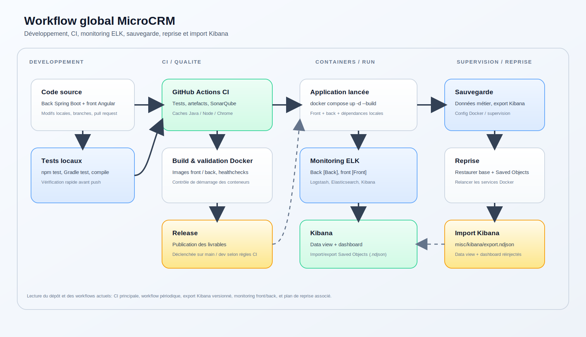

<p align="center">
   
</p>

# MicroCRM (P7 - Développeur Full-Stack - Java et Angular - Mettez en œuvre l'intégration et le déploiement continu d'une application Full-Stack)

MicroCRM est une application de démonstration basique ayant pour être objectif de servir de socle pour le module "P7 - Développeur Full-Stack".

L'application MicroCRM est une implémentation simplifiée d'un ["CRM" (Customer Relationship Management)](https://fr.wikipedia.org/wiki/Gestion_de_la_relation_client). Les fonctionnalités sont limitées à la création, édition et la visualisations des individus liés à des organisations.


## Code source

### Organisation

Ce [monorepo](https://en.wikipedia.org/wiki/Monorepo) contient les 2 composantes du projet "MicroCRM":

- La partie serveur (ou "backend"), en Java SpringBoot 3;
- La partie cliente (ou "frontend"), en Angular 17.

### Démarrer avec les sources

#### Serveur

##### Dépendances

- [OpenJDK >= 17](https://openjdk.org/)

##### Procédure

1. Se positionner dans le répertoire `back` avec une invite de commande:

   ```shell
   cd back
   ```

2. Construire le JAR:

   ```shell
   # Sur Linux
   ./gradlew build

   # Sur Windows
   gradlew.bat build
   ```

3. Démarrer le service:

   ```shell
   java -jar build/libs/microcrm.jar
   ```

Puis ouvrir l'URL http://localhost:8080 dans votre navigateur.

#### Client

##### Dépendances

- [NPM >= 10.2.4](https://www.npmjs.com/)

##### Procédure

1. Se positionner dans le répertoire `front` avec une invite de commande:

   ```shell
   cd front
   ```

2. (La première fois seulement) Installer les dépendances NodeJS:

   ```shell
   npm install
   ```

3. Démarrer le service de développement:

   ```shell
   npx @angular/cli serve
   ```

Puis ouvrir l'URL http://localhost:4200 dans votre navigateur.

### Exécution des tests

#### Client

**Dépendances**

- Google Chrome ou Chromium

Dans votre terminal:

```shell
cd front
CHROME_BIN=</path/to/google/chrome> npm test
```

#### Serveur

Dans votre terminal:

```shell
cd back
./gradlew test
```

### Qualité de code SonarQube

L'analyse SonarQube est branchée dans la CI GitHub Actions après les tests.

#### Prérequis

- Un serveur SonarQube ou SonarQube Cloud
- Un token SonarQube valide
- Une clé de projet SonarQube, ici `microcrm-projet-7`

#### Configuration GitHub

Ajoute dans les paramètres du dépôt :

- un secret `SONAR_TOKEN`
- la clé d'organisation SonarCloud `kevin-renault`

La CI utilise maintenant SonarCloud (`https://sonarcloud.io`) plutôt qu'un serveur local.

#### Rapports pris en compte

- couverture Java : `back/build/reports/jacoco/test/jacocoTestReport.xml`
- couverture Angular : `front/coverage/microcrm/lcov.info`

L'analyse couvre le backend et le frontend dans un seul projet SonarQube.

### Points critiques relevés et corrigés

- Côté front, les ressources CSS et les assets de production sont maintenant fingerprintés avec un hash grâce à `outputHashing: all` dans le build Angular.
- Ce point était critique pour éviter la persistance de fichiers CSS obsolètes après déploiement et limiter les comportements incohérents liés au cache navigateur ou au cache CDN.
- La correction est appliquée au build de production du frontend, ce qui garantit des noms de fichiers uniques à chaque nouvelle version.

### Préconisations d'usage

- Préférer une architecture multi-couche côté back, avec séparation entre API, service métier et persistance.
- Ajouter un handler global pour les erreurs côté backend afin de centraliser les réponses d'erreur et éviter les retours incohérents.
- Valider les données d'entrée au plus tôt, par exemple avec des contraintes Bean Validation sur les DTO ou les entités exposées.
- Conserver les logs métier et les logs techniques séparés pour faciliter le diagnostic dans ELK et dans la CI.

### Images Docker

#### Client

##### Construire l'image

```shell
docker build --target front -t orion-microcrm-front:latest .
```

##### Exécuter l'image

```shell
docker run -it --rm -p 80:80 -p 443:443 orion-microcrm-front:latest
```

L'application sera disponible sur https://localhost.

#### Serveur

##### Construire l'image

```shell
docker build --target back -t orion-microcrm-back:latest .
```

##### Exécuter l'image

```shell
docker run -it --rm -p 8080:8080 orion-microcrm-back:latest
```

L'API sera disponible sur http://localhost:8080.

#### Tout en un

```shell
docker build --target standalone -t orion-microcrm-standalone:latest .
```

##### Exécuter l'image

```shell
docker run -it --rm -p 8080:8080 -p 80:80 -p 443:443 orion-microcrm-standalone:latest
```

L'application sera disponible sur https://localhost et l'API sur http://localhost:8080.

### Stack ELK locale

Pour centraliser les logs applicatifs en local, lancer d'abord la stack ELK dédiée (Elasticsearch, Logstash et Kibana) :

```shell
docker compose -f docker-compose-elk.yml up -d
```

Puis démarrer l'application avec le compose principal :

```shell
docker compose up -d --build
```

Les logs JSON du back sont envoyés à Logstash quand le profil `elk` est actif. Kibana est ensuite disponible sur http://localhost:5601.

Les événements de monitoring du front sont envoyés au back via `/api/telemetry/front-logs`, puis réémis dans les logs applicatifs avec un champ `service: front`. Cela permet de les retrouver dans Kibana au même endroit que les logs du back, tout en les distinguant facilement.

### Sauvegarder et restaurer l'historique des logs

Bonnes pratiques : ne pas versionner les fichiers de logs dans Git. Pour partager ou restaurer l'historique des logs, utilisez soit des snapshots Elasticsearch (pour un restore complet), soit des exports NDJSON avec `elasticdump` pour des jeux de données plus petits.

Scripts fournis dans `scripts/` :
- `scripts/restore-snapshot.sh <repo> <snapshot>` : démarre la stack ELK (si nécessaire) puis déclenche une restauration depuis un repository de snapshot ES (filesystem). Le repository doit pointer vers un emplacement accessible par le conteneur Elasticsearch (ex : volume monté).
- `scripts/elasticdump-export.sh` : exporte les indices `microcrm-logs-*` vers `./dumps/` (utilise `elasticdump`).
- `scripts/elasticdump-import.sh ./dumps` : importe les fichiers JSON produits par `elasticdump` vers Elasticsearch local.

Exemples rapides :

1) Export avec `elasticdump` :
```bash
# installer elasticdump si besoin
npm install -g elasticdump
./scripts/elasticdump-export.sh
```

2) Importer les dumps sur une instance ES locale :
```bash
./scripts/elasticdump-import.sh ./dumps
```

3) Restaurer un snapshot (si vous avez préalablement sauvegardé un snapshot dans un repo accessible) :
```bash
./scripts/restore-snapshot.sh my_backup snapshot_2026_04_27
```

Notes :
- Pour les snapshots filesystem, il faut monter le dossier hôte contenant les snapshots dans `/usr/share/elasticsearch/snapshots` du conteneur Elasticsearch (voir `docker-compose-elk.yml` et ajouter un volume si nécessaire).
- Les dumps JSON peuvent contenir des données sensibles ; stockez-les de façon sécurisée.

#### Utilisation de Kibana

La stack charge déjà automatiquement ce qui existe côté Kibana via `docker-compose-elk.yml`, notamment la data view `microcrm-logs-*` et le dashboard `Flux front/back`.

La suite est donc purement informative si tu veux ajouter toi-même d'autres objets Kibana ou recréer manuellement une configuration de départ. Une fois Kibana ouvert, cliquer sur **Explore on my own**, puis :

1. aller dans **Stack Management**;
2. ouvrir **Data Views**;
3. cliquer sur **Create data view**;
4. saisir l'index `microcrm-logs-*`;
5. valider la création.

Ensuite, utiliser **Discover** pour consulter les logs bruts, filtrer par niveau `INFO`, `WARN` ou `ERROR`, puis créer si besoin un premier dashboard pour suivre le volume de logs et les erreurs.

Pour distinguer les sources, filtrer avec `service: front` pour le monitoring navigateur, ou `service: back` pour les logs serveur.

#### Importer la configuration Kibana sauvegardée

Le dépôt contient aussi un export Kibana prêt à réimporter dans [misc/kibana/export.ndjson](misc/kibana/export.ndjson). Il inclut la data view `microcrm-logs-*` et le dashboard `Flux front/back`.

Ce dashboard est orienté flux et regroupe trois vues complémentaires :

- le volume des requêtes front par méthode HTTP;
- le temps moyen de réponse du back par méthode HTTP;
- la répartition des réponses back par code HTTP.

Pour le réimporter dans Kibana :

1. aller dans **Stack Management**;
2. ouvrir **Saved Objects**;
3. cliquer sur **Import**;
4. sélectionner [misc/kibana/export.ndjson](misc/kibana/export.ndjson);
5. valider l'import et conserver les dépendances proposées.

Si Kibana demande un écrasement d'objets existants, l'accepter seulement si tu veux remplacer la version déjà présente dans l'espace courant.

#### Schéma du workflow global

Le dépôt contient aussi un schéma global du workflow, de la sauvegarde et de la reprise dans [misc/workflow-global.svg](misc/workflow-global.svg). Il résume le chemin complet: développement, CI, déploiement Docker, monitoring ELK, export Kibana, sauvegarde et reprise.



## Politique de release

Le projet utilise deux circuits de release, volontairement distincts:

- CI automatique (`.github/workflows/ci.yml`): la version est calculée par `semantic-release` depuis l'historique des commits conventionnels. Ce circuit publie les packages et les images Docker de release après validations qualité et tests.
- CI manuelle (`.github/workflows/manual-release.yml`): la version est calculée manuellement selon le choix utilisateur (`major`/`minor`/`patch`) et la note de release est un commentaire libre (`release_notes`).

Rationale:

- Le circuit automatique sert à industrialiser les livraisons normales.
- Le circuit manuel sert aux releases exceptionnelles pilotées par un PO (jalon, annonce, lot documentaire) tout en conservant le même comportement de publication.

## Setup rapide examinateur

Objectif: cloner le dépôt, démarrer, puis visualiser immédiatement un dashboard Kibana préchargé.

1. Cloner le dépôt et se placer à la racine.
2. Démarrer ELK:

```bash
docker compose -f docker-compose-elk.yml up -d
```

3. Démarrer l'application:

```bash
docker compose up -d --build
```

4. Vérifier les points d'accès:

- Front: `http://localhost`
- Back: `http://localhost:8080/actuator/health`
- Kibana: `http://localhost:5601`

5. Ouvrir Kibana et contrôler:

- Data view `microcrm-logs-*`
- Dashboard `Flux front/back`

Hypotheses d'execution:

- Docker Desktop est disponible.
- Les ports 80, 8080, 5601, 9200, 5044 sont libres.
- Le premier démarrage peut prendre plusieurs minutes (pull images + initialisation).

## Synthese finale des livrables

- CI/CD modulaire avec tests, analyse Sonar, build/push d'images et release.
- Monitoring centralise front/back via ELK, avec dashboard Kibana exportable (`misc/kibana/export.ndjson`).
- Plan de sauvegarde/reprise documente, avec scripts de restauration et d'export/import.
- Documentation DORA/KPI disponible (`PLAN_DORA.md`, `RAPPORT_DORA.md`) avec lecture des flux `branches -> dev` et `dev -> main`.
- Circuit de release automatique et circuit manuel documentes et distincts.
